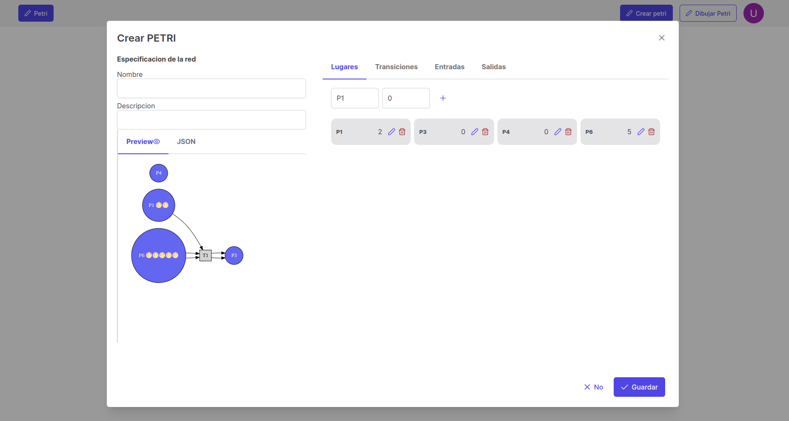
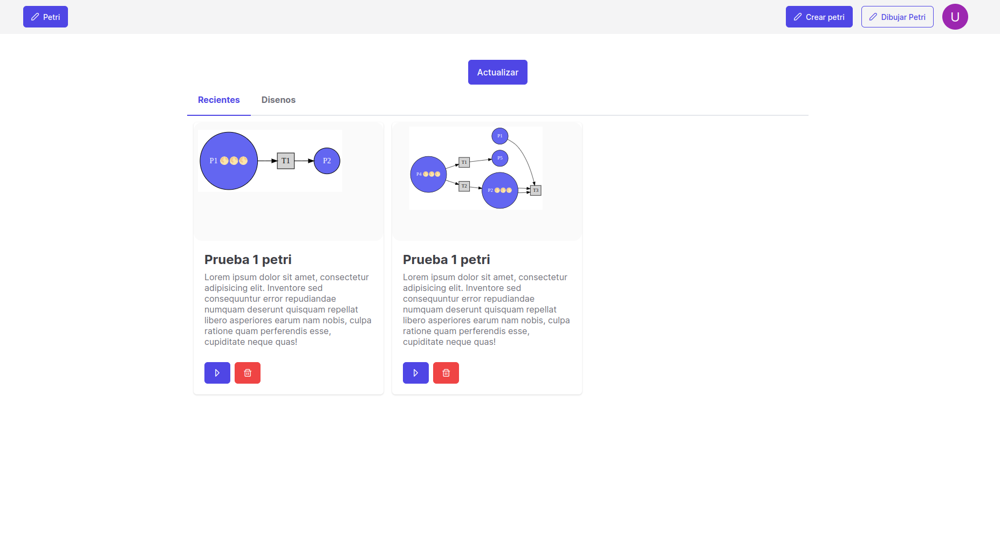
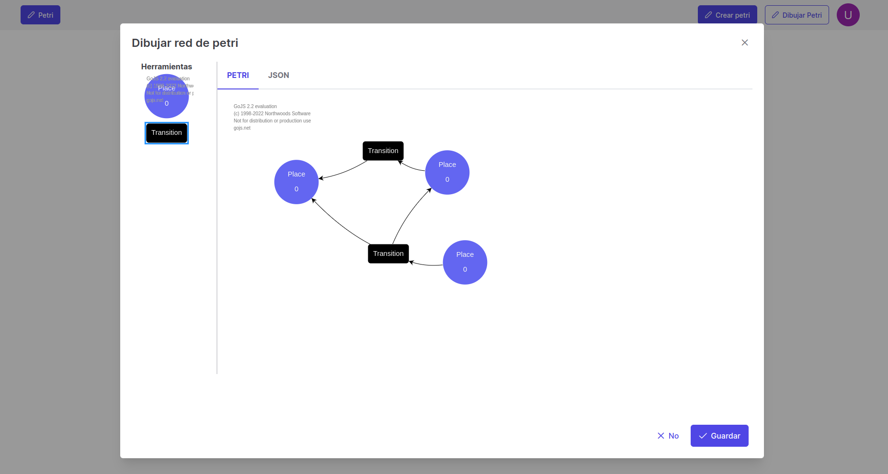
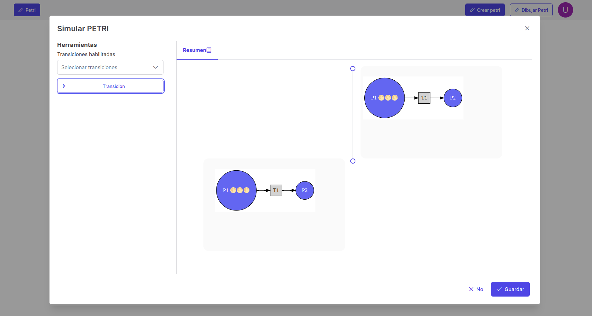

    

<h1 style="margin-top:10px;" align="center"> 🚀
  <strong> Petri Net </strong> 🔭
</h1>

## 🐧 Project explanation

This project allow create and simulate petri nets 🥅, tThis tool has both a json previewer as well as a visual
representation of the network.

## 📷 Screenshots

### 🦀 Create Petri Net

  

### 🐟 Home

    

Preview of the networks saved

### 🐞 Drawing Tool

    

### 😽 Simulation Tool

    

Timeline with states of Petri Net after execution of transitions enabled

## 👾 To get started
1. Clone this repository
2. Install dependencies``yarn install `` or ``npm install``
3. Run project in local ``yarn dev``

## 🙂 Coming soon

1. Integration to FastAPI 🍟 and Firebase 🔥
2. Deploy in Vercel ✅

## 🖋️ Authors

The developers have contributed to this project:

* Fabian Vera Carrillo 🙂 - <a href="https://github.com/fabianvera728"> fabianvera728 </a>
